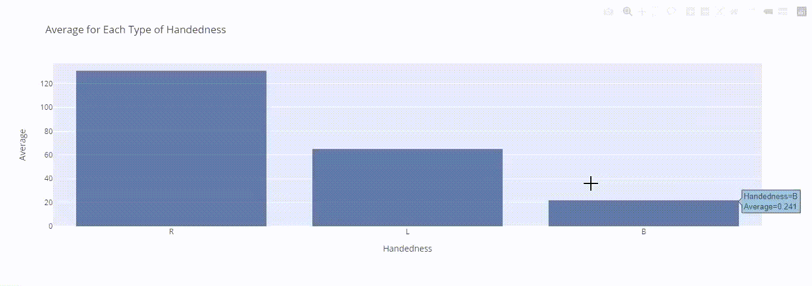
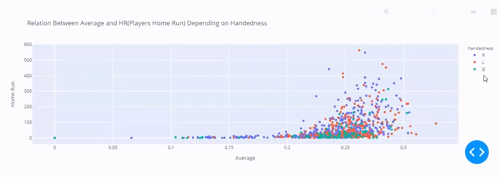

# Python-Dashboard

This project will encompass everything we have learned so far with Python Data Science tools.

The Basket Ball Dataset include numerical and catergical data, here is a simple description of the columns names:
- names :players name
- handedness: Right, left, and Both
- height: players height
- weight: players wight
- avg: average Of Winning
- HR: Players Home Runs

**Images:**\
**Figure 1:**
Interactive scatter plot to display HR and avg according on the names that are chosen

**Figure 2:**
Interactive bar plot to display avg for each headedness

**Figure 3:**
Interactive scatter plot to display HR and avg for all players

**Resources:**\
[Link of Dataset](https://github.com/jtrob704/BaseballData-Tableau/blob/master/baseball_data.csv)

**Group Members:**
- [Farah Sidina](https://github.com/faro7ah)
- [Sarah Alhugail](https://github.com/SarahAlhugail)
- [Eatidal Almutairi](https://github.com/eatidal)
- [Bedoor Alharbi](https://github.com/ibedoor)
